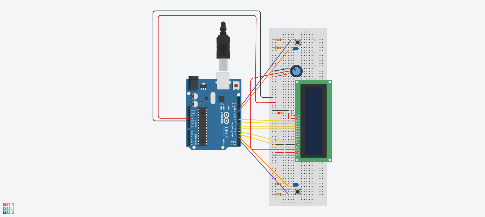

# CheckersClock Arduino

Once the application prototype was complete we faced a minor issue during its use: while recoding new games, user taps on the screen to take pictures could sometimes slightly move the smartphone making the chessboard go out of focus.
To face the problem we decided to develop a small arduino extension, consisting in a shift clock that connect to the smartphone via an OTG cable, once connected the application automatically detect the device and everytime the user click on the clock button during his turn a picture of the current position is taken.
**n.b.** the shift clock is an extension, and for this reason its use is optional, the application can still work using only the UI buttons

### Development

In the first instance we decided to delevolp the shift clock as an arduino entity in itself indipendent of the application.
at first we created the wire scheme:



the code that controls the application is quite simple, the `loop()` function is quite simple :

```
void loop() {
  handleButtons();
  handleLeds();
  handleTimes();
}
```

It consists of 3 calls:

* `hadleButtons()`: this function makes sure that a player's button is active only during is turn and that once pressed the turn is changed
* `handleLeds()`: this function makes sure that a player's led is lighted up only during his turn
* `handleTimes()`: this function computes the current time and updates the values on the clock' screen
