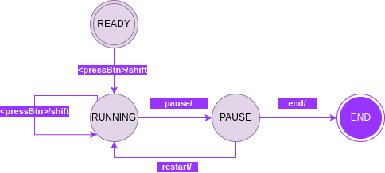

# CheckersClock Arduino

Once the application prototype was complete we faced a minor issue during its use: while recoding new games, user taps on the screen to take pictures could sometimes slightly move the smartphone making the chessboard go out of focus.
To face the problem we decided to develop a small arduino extension, consisting in a shift clock that connect to the smartphone via an OTG cable, once connected the application automatically detect the device and everytime the user click on the clock button during his turn a picture of the current position is taken.


**n.b.** the shift clock is an extension, and for this reason its use is optional, the application can still work using only the UI buttons

## Development

We decided to delevolp the shift clock as an arduino entity in itself indipendent of the application.
at first we created the wire scheme:


To keep the device as simple as possible the software inside the Arduino implements a finite state machine that follow this state graph:



The corresponding code that controls the application is quite simple, we show the `loop()` function next as an example :

```
void loop() {
  handleStateTransitions();
  if(state==READY)
  {
    handleLeds();
  } else if(state==RUNNING){
    handleButtons();
    handleLeds();
    handleTimes();
  }
  handleDisplay();
}
```

It consists of 5 calls:

* `handleStateTransitions()`: this function implements the state transition scheme as shown in th previous image
* `hadleButtons()`: this function makes sure that a player's button is active only during his turn and that once pressed the turn is changed
* `handleLeds()`: this function makes sure that a player's led is lighted up only during his turn
* `handleTimes()`: this function computes the time to subtract from the player who is in charge of moving
* `handleDisplay()`: this function updates the lcd display basing on the clock state

the communication between the clock and the application takes place in the serial channel, and has been implemented using the [Arduino-Library](https://github.com/omaraflak/Arduino-Library) by omaraflak that has been slightly modified to be compatible with the latest android versions
