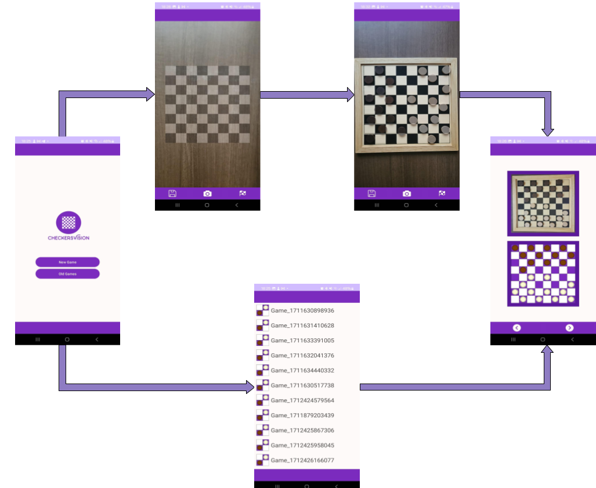

# CheckersVision App

This folder contains the code and materials necessary for implementing the Android Application, which was developed in Android Studio using Kotlin language.

### Controller

This subfolder contains the various activities of our application, and consequently most business logic.
There are four main activities:

* MainActivity: home page, allows the user to start a new game or view old ones.
* NewGameActivity: where pictures of the board are taken.
* PredictionActivity: recreates the virtual game image
* OldGamesActivity: log for old games.

### Model

This contains all the classes that make up our domain model. 
Specifically, we decided to split the checkers game representation into two branches: on one side there is the real game, on the other the predicted, virtual game, each with its own classes that mirror one another.

### Persistence

