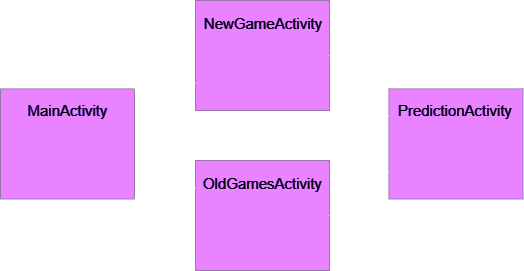

# CheckersVision App

This folder contains the code and materials necessary for implementing the Android Application. 

### Controller

This subfolder contains the various activities of our application, and consequently most business logic.
There are four main activities:

* MainActivity: home page, allows the user to start a new game or review old ones.
* NewGameActivity: where pictures of the board are taken.
* PredictionActivity: recreates the virtual game image.
* OldGamesActivity: log for old games.

Each one is associated with an activity layout, that defines the structure of the user interface of the respective activity.

The following picture shows the activity flow.

### Model

This contains all the classes that make up our domain model. In the first version, the same classes represented both the real games and their virtual counterparts; on top of that, all the pictures were evaluated eagerly as soon as the game was finished, and it resulted in greater overhead on the resources and longer wait time. 
For these reasons, we improved the model in subsequently versions. Specifically, we decided to split the checkers game representation into two branches: on one side there is the real game, on the other the predicted, virtual game, each with its own classes that mirror one another. We also switched from eager to lazy evaluation, so that the app model would make a prediction only of the current picture on the screen and not the entire set

### Persistence

It contains our Storage Manager, whose job is to access the application's local storage to save, retrieve, or delete the pictures taken by the user.

On top of that, it contains the function used to load the prediction model before starting the prediction process.
