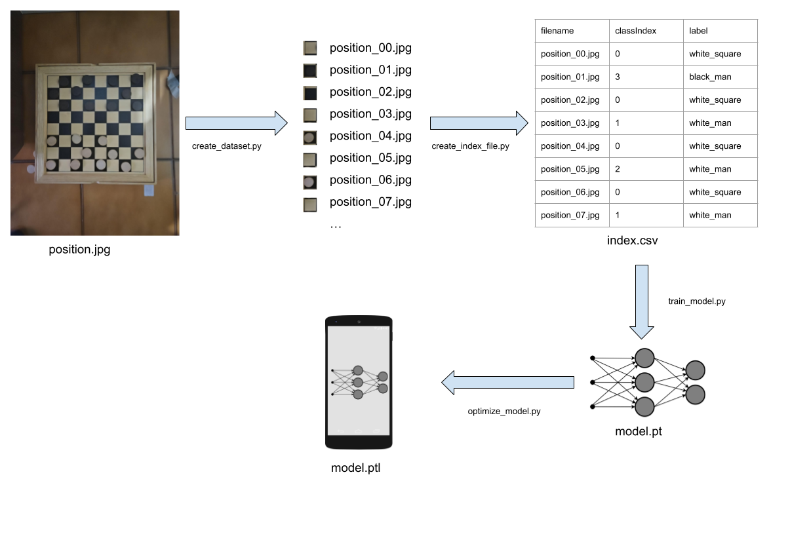

# CheckersVision Python

This folder contains the Python code developed to create, train, and test the model.
To create the classifier we decided to rely on the PyTorch library, which offers a variety of functionalities for computer vision applications, including exporting the generated models to mobile devices thanks to the PyTorch Mobile module.
The dataset was created from scratch, using the following process:

* We took pictures of checkers games and uploaded them inside the raw_train_data folder.
* We used the create_dataset.py script to split every checkers position image into single square pictures, which were then added to the train_data folder.
* We used the create_index_file.py script to classify every square image obtaining an index.csv for the dataset.
* We used the train_model.py script to generate a classifier, saved inside the classification_models folder.
* We tested the model using the raw_image_test_model.py and the camera_test_model.py scripts.
* We used the optimize_model.py script to export the model for mobile devices.

 

