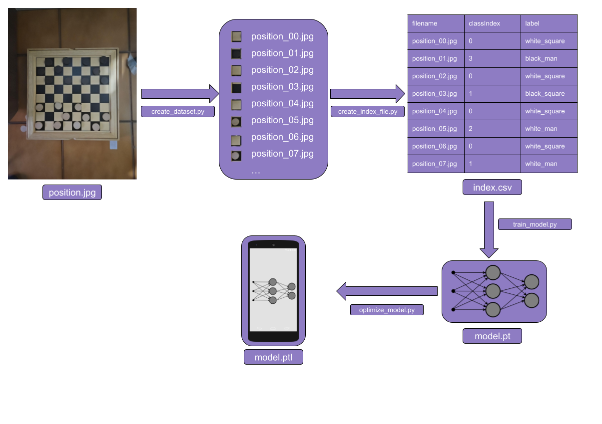

# CheckersVision Python

This folder contains the python code developed for creating, training and testing the model.
For the classifier creation we decided to rely on the Pytorch library which offers a variety of functionalities for computer vision applications, also allowing to export generated models to mobile devices by the Pytorch Mobile module.
The dataset has been created from scratch, using the following process:

* We took pictures of checkers games which were then inserted inside the raw_train_data folder.
* We used the create_dataset.py script to split every checkers' position image in single square pictures which were then inserted inside the train_data folder.
* We used the create_index_file.py script to classify every square image obtaining an index.csv for the dataset.
* We used the train_model.py script to generate a classifier, saved inside the classification_models folder
* We tested the model using the raw_image_test_model.py and the camera_test_model.py scripts
* We used the optimize_model.py script to export the model for mobile devices

 

