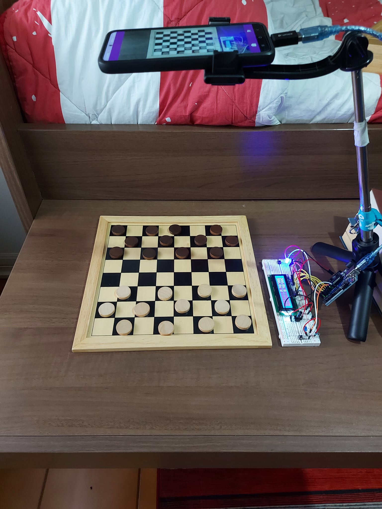
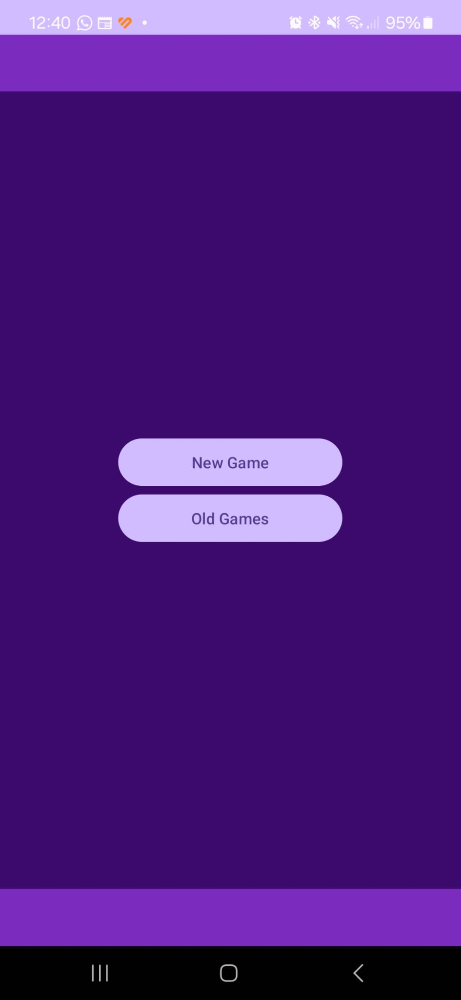
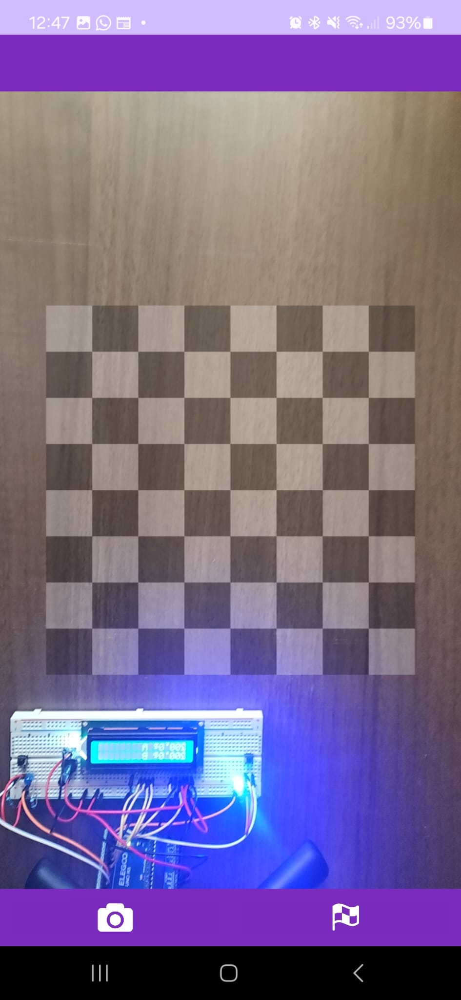
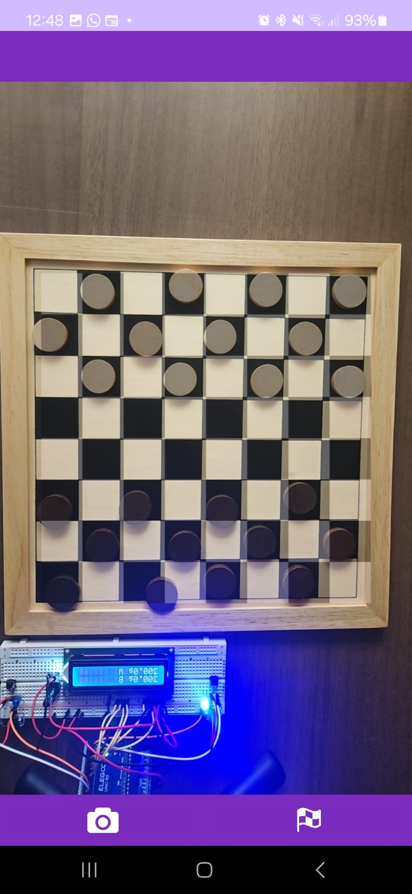
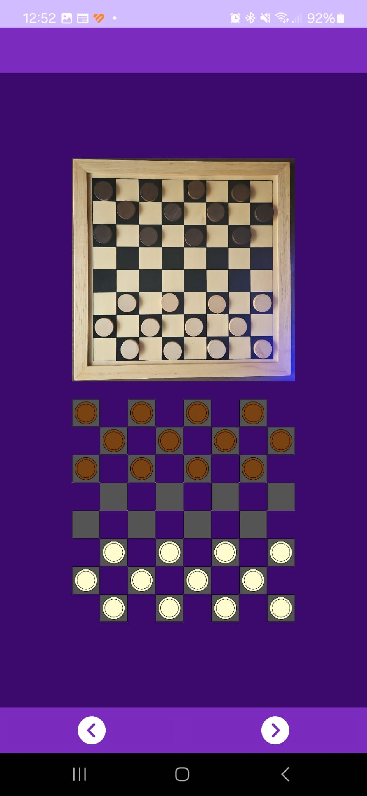
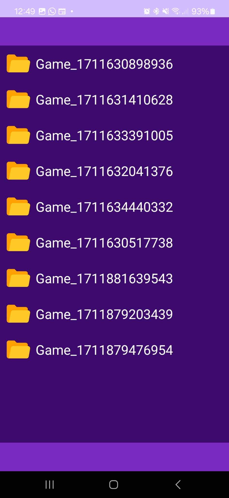

# CheckersVision

CheckersVision is an android application for the recognition of checkers games.
It allows users to create a digital representation of their on-board match by recording it with their mobile camera.
Recorded games are then stored inside the application so that users are able to access them whenever they want.

### Development

Its development followed 3 main phases:

* **model development** : during this first phase we used computer vision techniques to create a model capable of recognizing checkers position pictures, more details about how the model works can be found inside CheckersVisionPython folder
* **application development** : after that we developed the infrastructure of the android application, that was our final goal, more detail about it can be found inside CheckersVisionApp folder
* **shift clock extension development** : once we had a first working prototype of the application we decided to extend it developing an arduino shift clock capable of connecting to the application by an OTG cable, more detail about it inside CheckersClockArduino folder

### **Application Screenshots**

<table border="0px">

  <tr>
    <td colspan="4" >
      

      
      <h4>Use Case Example</h4>
      
in this picture we can see the typical use case of the application, the mobile is positioned over the board, connected to the shift clock, every time a player makes a and click his button  a picture of the checkers position is taken, once the game ends the user pass to an activity where the images are analyzed and predicted 

      

    </td>

  </tr>
  <tr rowspan="0"></tr>
  <tr>
    <td rowspan="3">

</td>
    <td>

</td>
    <td>

</td>
    <td rowspan="3">

</td>
  </tr>
  <tr rowspan="0"></tr>
  <tr>
    <td>

</td>
    <td></td>
  </tr>

<table>
