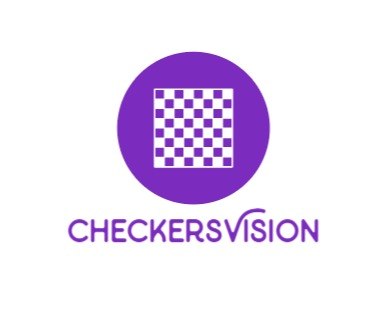

# CheckersVision

## Intro

CheckersVision is an Android application for the recognition of checkers games.
It allows users to create a digital representation of their on-board match by recording it with their mobile camera.
Recorded games are then stored inside the application so that users may access them whenever they want.

## Development

Its development followed 3 main phases:

* **Model Development**: during this first phase we used computer vision techniques to create a model capable of recognizing checkers position pictures, more details about how the model works can be found inside the [CheckersVisionPython readme](https://github.com/b3nny01/CheckersVision/tree/main/CheckersVisionPython/README.md).
* **Application Development**:  this phase revolved around developing a working infrastructure for the Android application,  more details about it can be found inside the [CheckersVisionApp readme](https://github.com/b3nny01/CheckersVision/tree/main/CheckersVisionApp/README.md).
* **Shift Clock Extension Development**: once the first working prototype was ready, it was expanded with an Arduino shift clock capable of connecting to the application by an OTG cable, more details about it can be found inside the [CheckersClockArduino readme](https://github.com/b3nny01/CheckersVision/tree/main/CheckersClockArduino/README.md).

## Final Result

In the following pictures we can see the typical use case of the application: the device is positioned over the board, connected to the shift clock, and every time a player makes a move and presses the button, a picture of the current board is taken. Once the game ends, the user moves on to another activity, where the images are analyzed and predicted.
  Alternatively, the user can review past games saved and stored by the application. 

 

## Credits

CheckersVision uses a modified version of the [Arduino-Library](https://github.com/omaraflak/Arduino-Library) by omaraflak.
The project has been developed by:

* [b3nny01](https://github.com/b3nny01/)
* [jjulespop](https://github.com/jjulespop/)
